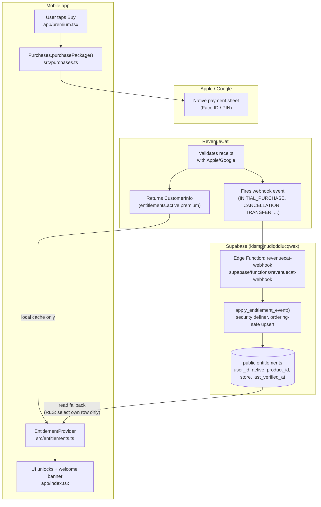

# Payment architecture

How a Premium purchase in "Leben in Deutschland" turns into a durable,
server-verified `premium = true` — from tap, to store, to RevenueCat, to
Supabase, back to the app.

## Diagram

## What each piece does

| Piece | File | Role |
|---|---|---|
| Buy button | `mobile/app/premium.tsx` | Loads the offering, starts `purchasePackage()`, handles cancel/fail/restore |
| RevenueCat SDK wrapper | `mobile/src/purchases.ts` | Configures the SDK with `appUserID = session.user.id` (ties RevenueCat identity to the Supabase account, not the store account), exposes `buyLifetime`/`restorePremium` |
| Entitlement state | `mobile/src/entitlements.ts` | Source of truth for `isPremium` in the UI. Asks RevenueCat's SDK live first (fast, works offline via its own cache); falls back to reading `public.entitlements` when that fails or isn't configured |
| Welcome banner | `mobile/src/premium-welcome-banner.tsx` + `mobile/app/index.tsx` | Shows on purchase/restore, and on a genuine login (`SIGNED_IN`) that resolves to an already-premium account |
| Webhook | `supabase/functions/revenuecat-webhook/index.ts` | The only writer of `public.entitlements`. Verifies the request, maps RevenueCat event types to a grant/revoke, calls the DB function |
| Ordering-safe write | `apply_entitlement_event()` (`supabase/migrations/0005_entitlements_webhook.sql`) | `security definer` SQL function; upserts only if the incoming event is newer than what's stored, so retries/out-of-order deliveries can't corrupt state |
| Server truth | `public.entitlements` (`supabase/migrations/0003_entitlements.sql`) | One row per user. RLS: a user may `select` only their own row; nothing beyond `service_role` may write |

## Why RevenueCat sits in the middle

Apple and Google receipts are opaque blobs that need validating against Apple/Google's own servers — RevenueCat does that validation, unifies both platforms behind one API, and re-broadcasts the result as a webhook. The app never talks to App Store/Play Store receipt APIs directly.

## Event handling in the webhook

| RevenueCat event type | Action |
|---|---|
| `INITIAL_PURCHASE`, `NON_RENEWING_PURCHASE`, `RENEWAL`, `UNCANCELLATION`, `PRODUCT_CHANGE`, `SUBSCRIPTION_EXTENDED`, `REFUND_REVERSED` | grant — `active = true` |
| `CANCELLATION`, `EXPIRATION` | revoke — `active = false` |
| `TRANSFER` | revoke every id in `transferred_from`, grant every id in `transferred_to` (this event carries no `entitlement_ids`, so it's applied unconditionally) |
| `TEST` | acknowledged, no write (RevenueCat dashboard's test ping) |
| Anything else (`BILLING_ISSUE`, paywall events, future types) | acknowledged, no write |

Every write goes through the same ordering guard: `last_verified_at` is always the *event's* timestamp, never `now()`, so a late retry of an older event can never clobber a newer one — no separate dedup table needed.

## Security

- **Webhook auth**: RevenueCat sends a static `Authorization` header, compared against the `REVENUECAT_WEBHOOK_AUTH` Supabase Edge Function secret using a timing-safe (hash-then-compare) check.
- **Write path**: only `service_role` can call `apply_entitlement_event()` or write `entitlements` directly — `anon`/`authenticated` are explicitly revoked. The client can only ever `select` its own row.
- **Identity binding**: RevenueCat's `app_user_id` is set to the Supabase `auth.users.id`, so a restore/webhook event is tied to the *account*, not the store account or device — works correctly across platforms and reinstalls.

## Status

| Layer | State |
|---|---|
| Client purchase/restore UI | ✅ built |
| `public.entitlements` + RLS | ✅ built |
| Webhook (grant/revoke/transfer, ordering guard) | ✅ built, deployed, verified with live synthetic events |
| RevenueCat Test Store product/entitlement/offering | ⏳ in progress |
| Real Apple/Google IAP products | ⏳ blocked on paid developer accounts |
| `EXPO_PUBLIC_REVENUECAT_IOS_API_KEY` / `_ANDROID_API_KEY` | ⏳ not set — only the Test Store key is |
| Real on-device purchase test | ⏳ blocked (Expo Go can't load native modules; needs a dev build) |

## Local testing without a store account

`mobile/src/purchases.ts` picks `EXPO_PUBLIC_REVENUECAT_TEST_API_KEY` over the real platform keys whenever `__DEV__` is true, routing purchases to RevenueCat's **Test Store** — a simulated store requiring no App Store/Play Console account. Note: this still requires a real native dev build (Expo Go cannot load the RevenueCat native module at all — it silently falls back to an unusable browser-billing mode instead).

The webhook itself can be exercised directly, independent of the app or a dev build, by POSTing a RevenueCat-shaped event to it with the correct `Authorization` header — this is how the write path was verified end-to-end before any real purchase existed.
